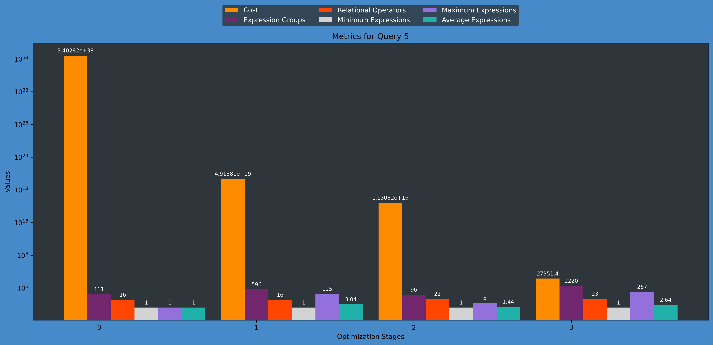

# RisingLight

-- Query Analyzer for RisingLight --
This toolset provides comprehensive analysis capabilities for SQL query optimization in RisingLight.

-- TODO --

- Complete the discussion section
- Change charts to new ones

**How to Use the Query Analysis Script**
The run.sh script offers a user-friendly interface for analyzing query performance and optimization processes.

```bash
./src/planner/script/run.sh
```

**Main Features**
- Execute Query: Run specific SQL queries (1-22)
- Extract Query Data: Collect performance metrics and optimization data
- Generate Visualizations: Create histograms and plots for:
    - Cost reduction across optimization stages
    - Node distribution in equivalence classes
    - Merge operations performed by the optimizer
- Batch Processing: Analyze multiple queries at once (all queries, ranges, or specific selections)

**Example Workflow**
To analyze a single query:
```bash
# Start the script
./src/planner/script/run.sh

# Choose option 7 (Full Analysis)
# Select query number (e.g., 5)
```
This will execute Query 5, extract all performance data, and generate all visualizations in the appropriate output directories.

**Output Files**
All analysis results are saved to src/planner/outputs/ with subdirectories for:

- Cost histograms showing optimization progress across stages
- CSV data files with detailed metrics
- Equivalence class visualizations
- Merge operation histograms

**Batch Analysis Options**
For analyzing multiple queries at once:

- Run full analysis for ALL queries (1-22)
- Run full analysis for a range of queries (e.g., 5-10)
- Run full analysis for specific queries (e.g., 3, 7, 12)

The batch analysis provides a consolidated view of optimization performance across multiple queries, helping identify patterns and areas for improvement.


**TODO** 
- Report

**DONE**
- We managed to add prints to see how many groups of equivalent expressions exist and how many expressions exist within these groups.
- We managed to add prints to distinguish between relational expressions and others.
- It can now write to file the number of relational expressions that exist per optimization phase.
- We have implemented the extraction of relevant information to file. File structure is as follows:
```csv 
Stage,Custo,Relacionais,Classes_Total,Min,Max,Media
0,340282350000000000000000000000000000000,6,61,1,1,1.00
1,28128.111,5,55,1,1,1.00
2,14618.112,6,55,1,6,1.38
3,14618.112,6,52,1,2,1.10

```
- We already have histogram implementations for better analysis. Graphs in the following format:



- We have information about each class and respective nodes. File structure is as follows:

```csv 
Stage,Class_ID,Node_Count,Nodes
3,0,1,Constant(Bool(true))
3,1,1,Column($4.3(1))
3,2,1,Column($4.1(1))
3,3,1,Column($4.0(1))
3,4,1,"List([3, 2, 1])"
3,5,1,Table($4)
3,6,3,"Scan([5, 4, 0]); Proj([4, 6]); Filter([0, 6])"
3,7,1,Column($3.3(1))
3,8,1,Column($3.0(1))
3,9,1,"List([8, 7])"
3,10,1,Table($3)
3,11,3,"Scan([10, 9, 0]); Proj([9, 11]); Filter([0, 11])"
```

- We have histograms for every stage with node information. Histogram as follows:


- Egg altered to provide more info
- Histogram for number of merges per stage:

----------------------------------


[](https://github.com/risinglightdb/risinglight/actions)
[](https://dbdb.io/db/risinglight)
[](https://crates.io/crates/risinglight)
[](https://docs.rs/risinglight)


RisingLight is an OLAP database system for educational purpose. It is still in rapid development, and should not be used in production.

## Quick Start

Currently, RisingLight only supports Linux or macOS. If you are familiar with the Rust programming language, you can
start an interactive shell with:

```
cargo run           # start in debug mode
cargo run --release # or start in release mode
```

If you meet with any build issues, see [Install, Run, and Develop RisingLight](docs/00-develop.md) for more
information. We provide step-by-step guide on how to compile and run RisingLight from scratch.

After successfully building RisingLight, you may import some data and run SQL queries. See [Running TPC-H Queries](docs/01-tpch.md).

## Documentation

All documentation can be found in [docs](docs/) folder.

At the same time, dev docs are also available in `make docs` (latest) or [crates.io](https://docs.rs/risinglight) (stable).

## License

RisingLight is under the Apache 2.0 license. See the [LICENSE](LICENSE) file for details.

## Community

### Governance

See [GOVERNANCE](GOVERNANCE.md) for more information.

### Communication

The main communication channel for RisingLight developers is [GitHub Discussions].

### Other Messaging Apps

If you want to join our active communication group in messaging apps including Discord, Telegram, and WeChat, please send an email to `contact at risingwave-labs.com` with your user ID. We will then manually invite you to the group.

## Contributing

If you have a bug report or feature request, welcome to open an [issue](https://github.com/risinglightdb/risinglight/issues).

If you have any question to discuss, welcome to start a discussion on [GitHub Discussions].

If you want to contribute code, see [CONTRIBUTING](CONTRIBUTING.md) for more information. Generally, you will need to
pass necessary checks for your changes and sign DCO before submitting PRs. We have plenty of [good first issues](https://github.com/risinglightdb/risinglight/issues?q=is%3Aopen+is%3Aissue+label%3A%22good+first+issue%22). Feel free to ask questions either on GitHub or in our chat groups if you meet any difficulty.

## Acknowledgement

The RisingLight project was initiated by a group of college students who have special interests in developing database systems using modern programming technologies. The project is generously sponsored by [RisingWave Labs](https://www.risingwave-labs.com/), a startup innovating the next-generation database systems. RisingWave Labs is hiring top talents globally to build a cloud-native streaming database from scratch. If interested, please send your CV to `hr at risingwave-labs.com` .

Welcome to the RisingLight community!

[GitHub Discussions]: https://github.com/risinglightdb/risinglight/discussions
